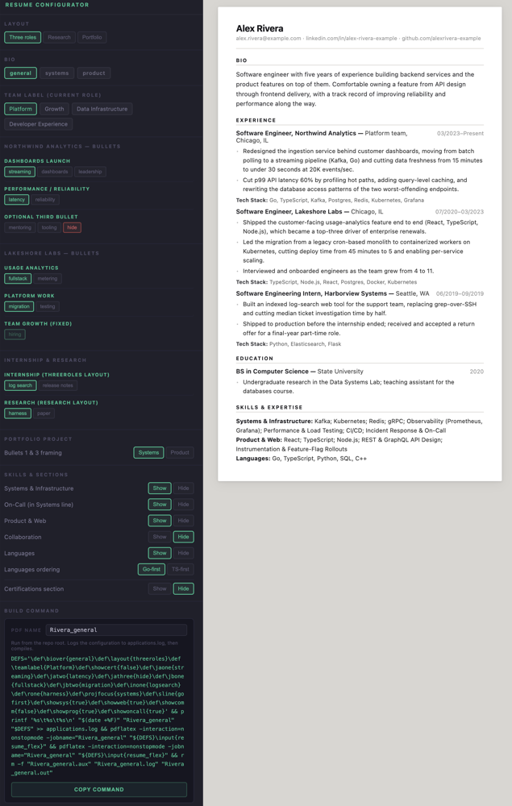

# Parametric Resume Builder

One LaTeX source file. Dozens of resume variants. Zero version drift.

## What is this?

I got tired of maintaining `resume_final_v3_ACTUAL.docx` and its
siblings, so I stopped treating my resume like a document and started
treating it like a function:

```
resume(parameters) → PDF
```

Concretely: a resume that lives in **one `.tex` file**, where alternate bios,
alternate phrasings of bullet points, optional content, and even the overall
document structure are controlled by **parameters injected at compile time**.

It ships with a small **web configurator** (a single local HTML file, no server,
no dependencies) that lets you toggle every option with a live preview and
generates the exact compile command.



The preview is HTML approximating LaTeX, not LaTeX. It's close enough to
choose between options, but it isn't pixel-accurate, and the real PDF will
look better. **Always compile and check the actual PDF before you send it**,
especially if your resume is over a page.

**And every command it hands you also appends a line to `applications.log`** —
date, output filename, full configuration. Name the output file something like `Rivera_acme_platform` (`compile.sh`
prompts for it; the configurator has a filename field) and that's what lands
in the log.

The repo is populated with a complete fictional example, **Alex Rivera,
software engineer**, so it compiles out of the box. Replace the content with
yours and keep the rest.

## Who is it for?

Anyone who tailors their resume per application and is tired of maintaining a
pile of near-duplicate files. You'll need a TeX distribution and basic comfort
editing a `.tex` file.

One working assumption is baked in: a tailored resume should still read as
*one coherent person*. The example never gives "Alex" a different career per
variant. Every variant draws on the same underlying work, just with different
**framing and emphasis**. 

## How do I start?

Requirements: a TeX distribution with `pdflatex` (TeX Live / MacTeX / MiKTeX)
including the `fontawesome`, `etoolbox`, and `enumitem` packages (all in the
full distributions).

**1. Compile the example** to confirm your toolchain works:

```bash
git clone <this-repo> && cd <this-repo>

./build.sh              # compile all 4 named example variants
./build.sh systems      # or just one: general | systems | product | research

./compile.sh            # interactive: prompts for every option

open configurator.html  # visual: toggle options, live preview, copy the compile command
```

The configurator doesn't compile anything itself — it's a static page that
builds the `pdflatex` command for you. Click **Copy command**, then paste it
into a terminal in the repo directory and run it — that's what produces the
PDF.

**2. Make it yours:**

1. Replace the name/contact block and every role in `resume_flex.tex` with your
   own content, keeping the `\ifx` slot pattern for any bullet you want
   alternate phrasings of.
2. Update the variable defaults and the header comment table. You're not
   limited to Alex's setup — add your own slots, drop ones you don't need,
   rename or add layouts, add a skill group Alex doesn't have. See
   [docs/EXTENDING.md](docs/EXTENDING.md) for a checklist for each (new
   bullet variant, new slot, new skill group, new layout).
3. Mirror your content into `configurator.html` (the bullet text is
   duplicated there, see [docs/EXTENDING.md](docs/EXTENDING.md) for the
   sync checklist).
4. Update the variant definitions in `build.sh` and the prompts in `compile.sh`.

I built this whole thing with [Claude Code](https://claude.com/claude-code),
and I'd genuinely recommend using it (or another AI coding assistant) to make
your changes rather than doing the multi-file sync by hand. The repo includes
a `CLAUDE.md` and two skills (`/add-bullet-variant`, `/add-skill-group`) that
already know the architecture, the TeX gotchas (see the "Critical TeX rules"
in `CLAUDE.md`, some of them fail *silently*), and every file a given change
needs to touch. Point your tool of choice at the repo, tell it what you want
to add, and let it handle the checklist.

## What if I already have multiple resume versions?

Then you're in the best possible starting position: your existing versions tell
you exactly where the parameters go.

1. **Diff your versions.** Anything identical across all of them is fixed
   content — it goes into `resume_flex.tex` as plain text, no conditional.
2. **Every place they disagree becomes a slot.** Each phrasing becomes one
   value of that slot (`\jaone` = `streaming | dashboards | leadership` in the
   example). Content that only *some* versions include — an extra bullet, a
   certification, a whole research section — becomes a `hide` value or a
   show/hide toggle rather than a separate document.
3. **Default every slot to the option you use most often.** Your most common
   resume should compile with zero flags, and your other versions with as few
   `\def`s as possible.
4. **Confirm each old file is now just one `\def` combination.** For every
   resume you used to keep as a separate file, find the settings that
   reproduce it (e.g. `\def\biover{systems}\def\jaone{dashboards}...`) and
   check the compiled PDF matches. Once you can regenerate every version this
   way, delete the old files — the parametric version replaces them.

## How do I change the formatting?

The look and the machinery are separate. All the conditional logic lives in
`resume_flex.tex`, while the visual style comes from the document class
(`resume.cls`, [Trey Hunner's open-source resume class](https://github.com/treyhunner/resume),
included unmodified).

- **Small tweaks** (spacing, fonts, margins): override in `resume_flex.tex`
  rather than editing the class, the file already does this
  (`geometry` setup, `\renewcommand{\sectionskip}{\smallskip}`), so there are
  examples to follow.
- **A different look entirely**: browse the
  [Overleaf CV gallery](https://www.overleaf.com/gallery/tagged/cv), pick a
  class or template you like (or modify one), and port the content over. The
  `\ifx` slot machinery is plain TeX and works under any class — what changes
  per class is the section/role markup around it. See the
  "Class file notes" in [docs/EXTENDING.md](docs/EXTENDING.md) for the traps
  specific to this class (e.g., no `\href` in the header).

Haven't used LaTeX before? Don't worry, this is a one-time cost. Once you land on formatting you like, it's set for every resume you generate afterward.

## The example: three resumes, one person

| Variant | Layout | Emphasis |
|---|---|---|
| `general` | Experience with 3 roles (2 jobs + internship) | balanced |
| `systems` | Experience + portfolio project | backend, performance, reliability |
| `product` | Experience + portfolio project | product delivery, collaboration |
| `research` | Industry + project + research experience | research credentials |

## The parameters

These are Alex's parameters, the specific layouts, slots, and skill groups
the fictional example uses. Yours will look different once you've made it
your own; this table is a reference for the example, not a schema you're
constrained to.

Structure and identity:

| Variable | Values | Default |
|---|---|---|
| `\biover` | `general \| systems \| product` | `general` |
| `\layout` | `threeroles \| research \| portfolio` | `threeroles` |
| `\teamlabel` | free text | `Platform` |
| `\showcert` | `true \| false` | `false` |

Bullet variants (each value is a different phrasing of the same work; `hide` drops the bullet):

| Variable | Slot | Values |
|---|---|---|
| `\jaone` | Job A, bullet 1 | `streaming \| dashboards \| leadership` |
| `\jatwo` | Job A, bullet 2 | `latency \| reliability` |
| `\jathree` | Job A, bullet 3 | `mentoring \| tooling \| hide` (default `hide`) |
| `\jbone` | Job B, bullet 1 | `fullstack \| metering` |
| `\jbtwo` | Job B, bullet 2 | `migration \| testing` |
| `\inone` | Internship, bullet 1 | `logsearch \| releasenotes` |
| `\rone` | Research role, bullet 1 | `harness \| paper` |
| `\projfocus` | Project bullets 1 & 3 | `systems \| product` |

Skills section:

| Variable | Effect | Default |
|---|---|---|
| `\sline` | Languages ordering: `gofirst \| tsfirst` | `gofirst` |
| `\showsys` | Systems & Infrastructure group | `true` |
| `\showweb` | Product & Web group | `true` |
| `\showcomm` | Collaboration group | `false` |
| `\showprog` | Languages group | `true` |
| `\showoncall` | inline: On-Call inside the Systems line | `true` |

## Application tracking

`compile.sh` and the configurator command append one tab-separated line per
build to `applications.log` (gitignored):

```
2026-07-14	Rivera_acme_platform	\def\biover{systems}\def\layout{portfolio}...
```

Date, output filename, exact configuration — enough to regenerate any PDF you've ever sent.

## Repo structure

```
resume_flex.tex     — the entire resume: content, variables, layout logic
resume.cls          — document class (Trey Hunner's open-source resume class)
build.sh            — named variant builder
compile.sh          — interactive builder (also logs to applications.log)
configurator.html   — local web UI: live preview + command generator
docs/EXTENDING.md   — architecture, TeX gotchas, how-to checklists
examples/           — pre-built PDFs of the four named variants
.claude/            — CLAUDE.md context + skills for Claude Code users
```

## Why LaTeX conditionals instead of a templating tool?

Because the whole point is *zero drift*: one file you edit, no generation step,
no intermediate representation, works with any TeX toolchain, and compiles
standalone with defaults if you just run `pdflatex resume_flex.tex`. The
conditional machinery is ~30 lines of preamble. See
[docs/EXTENDING.md](docs/EXTENDING.md) for how it works and the sharp edges
(`\ifx` vs `\ifdefstring`, why variable names can't contain digits).

Also, honestly: I just like LaTeX 💁🏻‍♀️ Thanks, Knuth.

## License

MIT, see [LICENSE](LICENSE). `resume.cls` is © 2010 Trey Hunner, distributed
under its own permissive notice preserved in the file.
